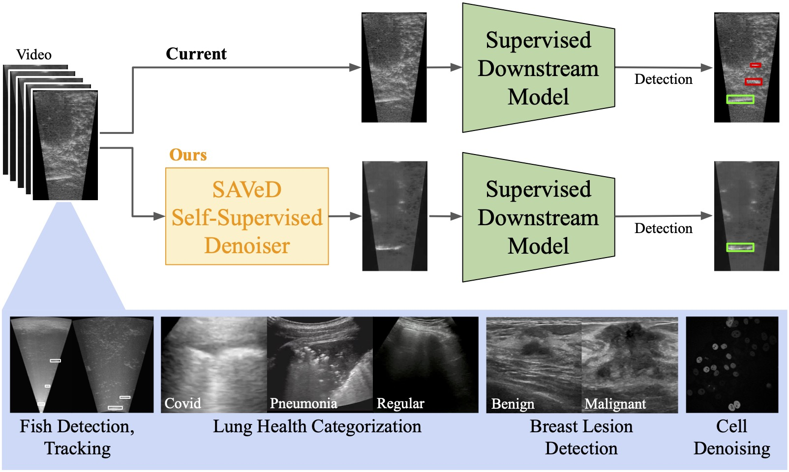

# SAVeD: Learning to Denoise Low-SNR Video for Improved Downstream Performance

<p align="center"></p> 

Implementation from the paper:
> Suzanne Stathatos, Michael Hobley, Markus Marks*, Pietro Perona*, [SAVeD: Learning to Denoise Low-SNR Video for Improved Downstream Performance](), March 2025.

SAVeD learns to denoise low-SNR video with no need for clean corresponding video, and works with a range of video including sonar, ultrasound, and miscroscopy video. Once trained, SAVeD can run inference to denoise video and this denoised video can be used for downstream tasks including classification, detection, tracking, and counting!

<p align="center"></p> 

Our code currently supports running denoising on low-SNR, grayscale video with a non-stationary background, potential occlusion, and where objects may not be uniquely identifiable by their appearance.


# Quick Start
Follow the instructions in `setup/setup.sh` to install the dependencies needed to run SAVeD on any dataset. 

Each dataset and other denoising library has its own setup script as well. 
Datasets and their baselines are downloaded and installed in `setup/setup_BUV.sh`, `setup/setup_CFC22.sh`, `setup/setup_Fluo.sh`, and `setup/setup_POCUS.sh`. 
Other denoising libraries are downloaded and installed in `setup/setup_udvd.sh` and `setup/setup_n2v.sh`.

Denoising training experiments, and thus examples of how to train and run inference with SAVeD, are provided in `denoise_runs.sh`.

## CFC22
First, follow the instructions in `setup/setup_CFC22.sh` to download and install the CFC22 dataset.

Training SAVeD on CFC22 can be done with the following command:
```
FRAMES_DIR=/path/to/CFC22/frames/
ANNOTATIONS_DIR=/path/to/CFC22/
python main.py --base_folder $FRAMES_DIR/raw_all --annotations_folder $ANNOTATIONS_DIR/annotations_mot_all --epochs 20 --batch_size 16 --resolution_target 1024 --fine_layers --bottleneck_size 512 --with_skip_connections --target "gap1_and_curr_frame" --results_path "checkpoints/all_denoised_1024_fine_bnck_512_gap1_and_curr_frame_skip_adamw_plateau_scheduler_f0.1_pat2" --model_type "cnn" --optimizer "adamw" --scheduler "plateau" --factor 0.1 --patience 2
```

This will take ~20 hours on 2 NVIDIA RTX 4090 GPUs.
Running inference with SAVeD as we do in the paper can be done with the following set of commands:
```
RESULTS_DIR=/path/to/results/
FRAMES_DIR=/path/to/CFC22/frames/
domains=("kenai-train" "kenai-val" "elwha")
for domain in "${domains[@]}"; do
    python denoise.py --model "checkpoints/all_denoised_1024_fine_bnck_512_gap1_and_curr_frame_skip_adamw_plateau_scheduler_f0.1_pat2/best_model.ckpt" --input_dir $FRAMES_DIR/raw/$domain --output_dir $RESULTS_DIR/frames/all_denoised_1024_fine_bnck_512_gap1_and_curr_frame_skip_adamw_plateau_scheduler_f0.1_pat2/$domain --model_type "cnn" --resolution_size 1024 --fine_layers --bottleneck_size 512 --with_skip_connections
done
```

Then combining SAVeD's denoised output with the CFC22's background-subtracted frames can be done as follows:
```
DENOISED_DIR=/path/to/frames/all_denoised_1024_fine_bnck_512_gap1_and_curr_frame_skip_adamw_plateau_scheduler_f0.1_pat2
OTHER_FRAMES_DIR=/path/to/CFC22/frames/raw_bs/
ADDED_FRAMES_DIR=/path/to/CFC22/frames_with_denoised
for domain in ${domains[@]}; do
    python setup/add_denoised_to_raw_2_ch.py\
        --denoised_imgs $DENOISED_DIR/$domain \
        --raw_imgs $OTHER_FRAMES_DIR/$domain \
        --added_imgs $ADDED_FRAMES_DIR/$domain
done
```

Finally, training the detector model and running inference, tracking, and counting:
```
GTDIR=/path/to/CFC22/annotations_mot
YOLO_DIR=/path/to/CFC22/yolo_dataset_denoised_2_ch
EXP_NAME="SAVeD_denoised_2_ch"
RESULTS_DIR=/path/to/$EXP_NAME_results
python setup/convert_mot_to_yolo.py --mot-dir $GTDIR --frames-dir $ADDED_FRAMES_DIR --output-dir $YOLO_DIR
python train_detector.py --data $YOLO_DIR/data.yaml --epochs 5 --batch-size 16 --weights 'yolov5s.pt' --img-size 896 --project 'yolo_train' --name $EXP_NAME
domains=("kenai-train" "kenai-val" "elwha")
for domain in "${domains[@]}"; do
    python detect.py --dataset $domain --det_model yolo_train/$EXP_NAME/weights/best.pt --input_dir $ADDED_FRAMES_DIR --output_dir $RESULTS_DIR --gt_dir $GTDIR
    python eval_detector_tm.py --dataset $domain --det_model yolo_train/$EXP_NAME/weights/best.pt --input_dir $ADDED_FRAMES_DIR --output_dir $RESULTS_DIR --gt_dir $GTDIR | grep mAP
    python track.py --dataset $domain --frames_dir $ADDED_FRAMES_DIR --detections_dir $RESULTS_DIR 
    python track_eval.py --dataset $domain --frames_dir $ADDED_FRAMES_DIR --track_dir $RESULTS_DIR --annos_root $GTDIR
    python count.py --dataset $domain --frames_dir $ADDED_FRAMES_DIR --track_dir $RESULTS_DIR 
    python eval_count.py --dataset $domain --frames_dir $ADDED_FRAMES_DIR --track_dir $RESULTS_DIR | grep nMAE
done
```

## BUV
First, follow the instructions in `setup/setup_BUV.sh` to download and install the BUV dataset and it's baseline downstream model.

Training SAVeD on BUV can be done with the following command:
```
python main.py --dataset "CVA" --base_folder /root/CVA-Net/miccai_buv/rawframes_median --epochs 40 --batch_size 8 --resolution_target 1024 --fine_layers --bottleneck_size 512 --with_skip_connections --target "gap1_inverted_and_curr_frame" --results_path "checkpoints/CVA_denoised_1024_fine_bnck_512_gap1_inverted_and_curr_frame_SKIP_40_epoch_median_sq" --model_type "cnn"
```

Running inference with SAVeD as we do in the paper can be done with the following set of commands:
```
classes=("benign" "malignant")
for class in "${classes[@]}"; do
    python denoise_CVA.py --model "checkpoints/CVA_denoised_1024_fine_bnck_512_gap1_inverted_and_curr_frame_SKIP_40_epoch_median_sq/best_model.ckpt" --input_dir /root/CVA-Net/miccai_buv_median/rawframes_median/$class --output_dir /root/CVA-Net/miccai_buv_median/rawframes_median_denoised/$class --model_type "cnn" --resolution_size 1024 --fine_layers --bottleneck_size 512 --with_skip_connections
done
for class in "${classes[@]}"; do    
    python setup/add_denoised_to_raw_2_ch.py\
        --denoised_imgs /root/CVA-Net/miccai_buv_median/rawframes_median_denoised/$class \
        --raw_imgs /root/CVA-Net/miccai_buv_median/rawframes_median/$class \
        --added_imgs /root/CVA-Net/miccai_buv/rawframes_median_denoised_2_ch/$class
done
```

Move the frames to the location where the downstream model expects them:
```
mv /root/CVA-Net/miccai_buv/rawframes /root/CVA-Net/miccai_buv/rawframes_baseline
mv /root/CVA-Net/miccai_buv/rawframes_median_denoised_2_ch /root/CVA-Net/miccai_buv/rawframes
```

Follow the instructions in  to train the downstream model on the denoised frames.
```
./configs/configs.sh
```

## POCUS
First, follow the instructions in `setup/setup_POCUS.sh` to download and install the POCUS dataset and it's baseline downstream model and to create median-filtered frames.

Train the denoiser on the POCUS dataset:
```
cd path/to/covid19_ultrasound/pocovidnet
python scripts/build_image_dataset.py
PATH_TO_DATASET=/path/to/covid19_ultrasound/data/image_dataset

python main.py --dataset "POCUS" --base_folder $PATH_TO_DATASET --epochs 120 --batch_size 16 --resolution_target 1024 --fine_layers --bottleneck_size 512 --with_skip_connections --target "gap1_and_curr_frame" --results_path "checkpoints/POCUS_denoised_1024_fine_bnck_512_gap1_and_curr_frame_SKIP" --model_type "cnn"
```

Run inference with SAVeD as we do in the paper:
```
PATH_TO_DATASET=/path/to/covid19_ultrasound/data/pocus_videos_frames_median
PATH_TO_VIDEOS=/path/to/covid19_ultrasound/data/pocus_videos
domains=("convex" "linear")
for domain in "${domains[@]}"; do
    python denoise_POCUS.py --model "checkpoints/POCUS_denoised_1024_fine_bnck_512_gap1_and_curr_frame_SKIP_on_median/best_model.ckpt" --input_dir $PATH_TO_DATASET/$domain --output_dir $PATH_TO_DATASET_denoised/$domain --model_type "cnn" --resolution_size 1024 --fine_layers --bottleneck_size 512 --with_skip_connections
done
for domain in "${domains[@]}"; do
    python setup/add_denoised_to_raw_2_ch.py \
        --denoised_imgs $PATH_TO_DATASET_denoised/$domain \
        --raw_imgs $PATH_TO_DATASET/$domain \
        --added_imgs $PATH_TO_DATASET_denoised_2_ch/$domain
done
for domain in "${domains[@]}"; do
    python setup/convert_frames_to_videos.py --frames_dir $PATH_TO_DATASET_denoised_2_ch/$domain --video_dir "$PATH_TO_DATASET_videos/${domain}_median_denoised_2_ch"
done

for domain in "${domains[@]}"; do
    rm -rf ${PATH_TO_VIDEOS}/${domain}
    mv ${PATH_TO_VIDEOS}/${domain}_median_denoised_2_ch ${PATH_TO_VIDEOS}/${domain}
done
```

Train the downstream model following the instructions in .
```
python3 scripts/build_image_dataset.py
python scripts/cross_val_splitter.py --splits 5
python scripts/train_covid19.py --data_dir ../data/cross_validation --fold 0 --epochs 40
```

Repeat for each fold.

## Fluo

Follow the instructions in `setup/setup_Fluo.sh` to download and install the Fluo dataset and format it properly.

Train the denoiser on the Fluo dataset:
```
FLUO_DIR=/path/to/Fluo_median_flat
python main.py --dataset "Fluo" --base_folder $FLUO_DIR --epochs 1000 --batch_size 8 --resolution_target 1024 --fine_layers --bottleneck_size 512 --with_skip_connections --target "identity" --results_path "checkpoints/Fluo_median_denoised_1024sq_fine_bnck_512_identity_SKIP_1000_epochs" --model_type "cnn"
```

Run inference with SAVeD as we do in the paper:
```
FLUO_DIR=/path/to/Fluo_median_flat
FLUO_DENOISED_DIR=/path/to/Fluo_median_denoised_identity_1000_epochssq
domains=("train" "test")
for domain in "${domains[@]}"; do
    python denoise_Fluo.py --model "checkpoints/Fluo_median_denoised_1024sq_fine_bnck_512_identity_SKIP_1000_epochs/best_model.ckpt" --input_dir $FLUO_DIR/$domain --output_dir $FLUO_DENOISED_DIR/$domain --model_type "cnn" --resolution_size 1024 --fine_layers --bottleneck_size 512 --with_skip_connections
done
```

We only use qualitative results from the Fluo dataset in the paper, so no downstream tasks are performed.

## Your own dataset
If you would like to train SAVeD on your own dataset, please organize the data as follows:

1. Extract the frames and put all the frames in a directory in the following format:
```
dataset_name/
    |-- domain_1/
        |-- video0
            |-- frame0.png
            |-- frame1.png
            |-- ...
        |-- videoN
            |-- frame0.png
            |-- frame1.png
            |-- ...
    |-- domain_2/
        |-- video0
            |-- frame0.png
            |-- frame1.png
            |-- ...
        |-- videoN
            |-- frame0.png
            |-- frame1.png
            |-- ...
```
* Image file names should be in ascending order to be able to take defined window-size chunks of frames.

2. Flatten each of the domains into a single directory using `setup/create_dataset_with_all_frames.py`:
This will create a new directory as follows:
```
dataset_name_flat/
    |-- domain_1-video0
        |-- frame0.png
        |-- frame1.png
        |-- ...
    |-- domain_1-videoN
        |-- frame0.png
        |-- frame1.png
        |-- ...
    |-- domain_2-video0
        |-- frame0.png
        |-- frame1.png
        |-- ...
    |-- domain_2-videoN
        |-- frame0.png
        |-- frame1.png
        |-- ...
```

3. Create a dataset class in `dataset/` with a CustomDatasetDataModule.py file. 

4. Modify `main.py` to recognize the dataset as a new dataset.

3. Run `main.py` to train the denoiser on your custom dataset.
```
python main.py --dataset "custom_dataset" --base_folder /path/to/dataset_name_flat --epochs 100 --batch_size 8 --resolution_target 1024 --fine_layers --bottleneck_size 512 --with_skip_connections --target "gap1_and_curr_frame" --results_path "checkpoints/custom_dataset_denoised_1024_fine_bnck_512_gap1_and_curr_frame_SKIP" --model_type "cnn"
```


## License and Citation

Please refer to our paper for details and consider citing it if you find the paper or code useful:
```
@article{saved2025,
title={SAVeD: Learning to Denoise Low-SNR Video for Improved Downstream Performance},
author={Stathatos, Suzanne and Hobley, Michael and Marks, Markus and Perona, Pietro},
journal={},
year={2025},
}
```

Our code is available under the [Apache License 2.0](https://www.apache.org/licenses/LICENSE-2.0).